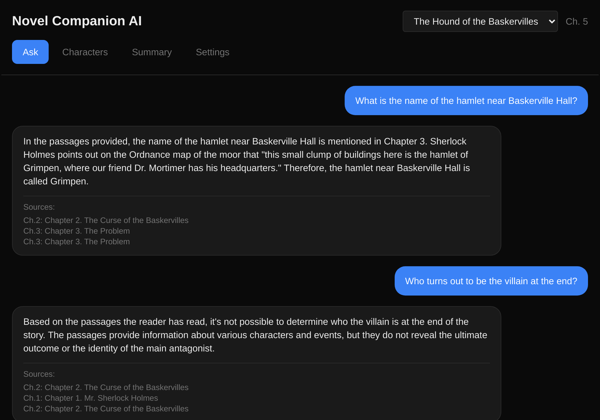

# Novel Companion AI

[](https://github.com/HAK978/novel-companion-ai/actions/workflows/ci.yml)

**Ask anything about a 3,000-chapter web novel, without spoilers.**

A self-hosted AI reading companion. It answers questions, recaps what you've read and looks
up characters using only the chapters you've reached, even when the model already knows
how the book ends. Built as FastAPI services around a RAG pipeline and a local LLM (Mistral
Nemo 12B on vLLM), with an evaluation harness behind every change and an MCP server that
lets Claude use it as a set of tools.



## Highlights

| | |
|---|---|
| **Scale** | Shadow Slave: 3,025 chapters, 3.7M words, indexed in 11 minutes. Early chapters are searchable within seconds while the rest loads |
| **Retrieval** | Small-to-big retrieval raised retrieval recall from 42% to 53% on 262 questions (p < 0.001) |
| **Answers** | Answer accuracy on the evaluation set rose from 56% to 68%, with fewer wrong answers |
| **Spoiler safety** | Retrieval never sees unread chapters. System-prompt rules cut leaks on spoiler-inviting questions from 7 of 20 answers to 0 of 40, and a name filter removes names the reader hasn't reached |
| **Evaluation** | A golden question set scored in code. An LLM judge matched reference labels on only 30 of 47 spoiler calls, so it was replaced |
| **Fully local** | Embeddings, LLM, vector store and databases run on one machine. No paid APIs |

## Why

Web serials often run to thousands of chapters. It's easy to forget who a character is or
what happened a few hundred chapters back, but wikis and summaries are written for people
who finished the book, so looking anything up means getting spoiled.

## How it works

**Spoiler-safe retrieval.** Every passage is indexed with its chapter number, and the
retrieval service filters on `chapter_number <= current_chapter` before searching, so the
model never sees unread text. The filter is enforced server-side, not left to the prompt.

**Small-to-big retrieval.** The embedding model reads only the first 256 tokens of a text,
so each 400-word passage is indexed as smaller windows. Search ranks the windows and hands
the model the whole passages they belong to. Four designs were benchmarked on the same
questions before this one shipped (`eval/experiments/chunk_windows.py`).

**Guardrails against the model's memory.** A model may already know a famous book. Asked at
chapter 5 of *The Hound of the Baskervilles* who "turns out to be the villain", it named the
culprit from memory; across four such questions it leaked in 7 of 20 answers. The reader's
position and a no-outside-knowledge rule now go to the model as a system message: 0 of 40.
It can still slip in a remembered name, so ingestion records the chapter where every word of
the book first appears, and names the reader hasn't reached are removed before an answer is
shown. A real answer at chapter 14:

> Model: "…the woman tied to the post in Stapleton's house is his wife, **Beryl Garcia**."
> Shown: "…the woman tied to the post in Stapleton's house is his wife, **Beryl**."

"Garcia" first appears in chapter 15. On that question the model added the name in 7 of 24
answers; every one was removed.

**Chapter summaries in the background.** Celery workers write a summary of each chapter,
newest first from where the reader is, and flag any name the book hasn't used by that
chapter: a sign the model filled in from memory.

**Evaluation.** A question set built for each reading position, with spoiler traps and
questions about people who don't exist, scored in code (see [Evaluation](#evaluation)).

## Architecture

```
                    ┌──────────────┐        ┌─────────────────┐
   Next.js UI ─────▶│              │        │  MCP clients    │
                    │   Gateway    │◀───────│  (Claude Code,  │
   REST clients ───▶│    :8000     │        │   Desktop)      │
                    └──────┬───────┘        └─────────────────┘
                           │
        ┌──────────────────┼──────────────────┐
        ▼                  ▼                  ▼
  ┌───────────┐     ┌───────────┐      ┌────────────┐
  │ Ingestion │     │ Retrieval │      │ Generation │
  │   :8001   │     │   :8002   │      │   :8003    │
  └─────┬─────┘     └─────┬─────┘      └──────┬─────┘
        │                 │                   │
   ┌────▼────┐       ┌────▼─────┐        ┌────▼─────┐
   │ Celery  │       │ ChromaDB │        │  vLLM    │
   │ + Redis │──────▶│ (vectors)│        │  :8004   │
   └────┬────┘       └──────────┘        └──────────┘
        │
   ┌────▼───────┐
   │ PostgreSQL │  chapters, characters, relationships, progress
   └────────────┘
```

- **Gateway** — entry point; orchestrates retrieval → generation, manages novels and progress
- **Ingestion** — Celery workers: clean HTML → chunk → embed → store; pluggable source adapters.
  Each chunk is embedded as smaller windows, since the embedding model reads only the first 256
  tokens of a text.
  A background worker also writes a short summary of each chapter, for questions that span
  many chapters.
- **Retrieval** — vector search with chapter filtering and range scoping: windows are ranked,
  and whole chunks are returned
- **Generation** — prompts and calls to the language model: any OpenAI-compatible endpoint,
  vLLM by default

## Stack

FastAPI · Celery · Redis · PostgreSQL 16 · ChromaDB · `all-MiniLM-L6-v2` embeddings (ONNX,
pinned in code) · vLLM serving Mistral Nemo 12B · Next.js + TypeScript + Tailwind ·
Docker Compose

## MCP server

`services/mcp/server.py` exposes the system over stdio:

| Tool | Purpose |
|---|---|
| `list_novels` | Available novels and chapter counts |
| `query_novel` | Question answering, scoped to reading progress |
| `get_character` | Character lookup: aliases, relationships, mentions |
| `summarize_chapters` | Summarize a chapter range |
| `catch_me_up` | Recap recent chapters |
| `get_reading_progress` / `set_reading_progress` | Read and update position |
| `system_health` | Service health across the stack |

Content tools read stored progress and clamp the requested chapter to it, so the scoping
holds no matter what the client asks for.

Claude Code picks it up from `.mcp.json` when started in this repository (the server needs
`pip install -r services/mcp/requirements.txt`). To use it from any directory:

```bash
claude mcp add novel-companion --scope user \
  --env GATEWAY_URL=http://localhost:8000 \
  -- python3 /path/to/services/mcp/server.py
```

## Running it

Needs Docker with Compose. The language model can be any OpenAI-compatible endpoint: by
default Compose serves Mistral Nemo with vLLM on an NVIDIA GPU, or set `LLM_BASE_URL`,
`LLM_MODEL` and `LLM_API_KEY` in `.env` to use a hosted model and skip the GPU.

```bash
cp .env.example .env
docker compose up -d                  # everything except the model server
docker compose --profile gpu up -d    # also serve the model with vLLM
```

The first start builds the images. The web UI is then at http://localhost:3000, and
`curl localhost:8000/health` reports on every service. Ports are published on localhost only.
Services come back on their own after a reboot, but the model server does not: on a shared
machine, `scripts/start_vllm.sh` starts it on an idle GPU and `docker compose stop vllm`
releases it.

Chapter summaries are written in the background while the model is being served, up to 100
chapters past the furthest reader, starting with the chapters just read, and extended as
reading progress moves on; `curl localhost:8000/novels/1/summaries` shows how far they have got.

Before any service starts, a one-shot `migrate` container applies pending `migrations/*.sql`
in order and records each in a `schema_migrations` table, so this always answers "is the
database up to date?":

```bash
docker compose run --rm migrate python scripts/migrate.py --status
```

Add a novel and ingest it. The ingestion worker reads novels from `data/novels` (or
`NOVEL_DATA_DIR` in `.env`), mounted at `/novels`, so source paths start there:

```bash
cp -r ~/my-novel data/novels/

curl -X POST localhost:8000/novels -H 'Content-Type: application/json' \
  -d '{"title": "My Novel", "source_type": "local_json"}'

curl -X POST localhost:8000/ingest/from-source -H 'Content-Type: application/json' \
  -d '{"novel_id": 1, "source_type": "local_json", "source_path": "/novels/my-novel"}'
```

Adapters handle directories of JSON chapter files and EPUB (`"source_type": "epub"` with a
path like `/novels/book.epub`). Ingestion runs through Celery; poll `/ingest/status/{task_id}`
for progress. Chapters are indexed in reading order and can be asked about as soon as they
are in, so questions about the opening chapters work within seconds while the rest of the book
is still loading. The 3,026 chapters of Shadow Slave took 11 minutes on the development
server.

Ask something:

```bash
curl -X POST localhost:8000/query -H 'Content-Type: application/json' \
  -d '{"query": "Who is the protagonist travelling with?", "novel_id": 1, "current_chapter": 500}'
```

## Layout

```
services/       gateway, ingestion, retrieval, generation, mcp
migrations/     PostgreSQL schema
scripts/        database and embedding migrations, model server start
tests/          unit, API, database and end-to-end tests
frontend/       Next.js app
training/       dataset generation for fine-tuning
```

## Status

Working: ingestion at scale, question answering, summaries, progress tracking, the MCP
server and the web UI, with every novel fully isolated. Character questions are answered
through search; the structured character graph is not populated yet.

Next: hybrid keyword and vector search with reranking, the character graph through
schema-constrained extraction, streaming responses and request tracing.

## Tests

```bash
pip install -r requirements-dev.txt
pytest
```

The suite runs in tiers:

- **Unit and API tests** use stubbed HTTP clients and need nothing running.
- **Vector-store tests** run an embedded ChromaDB in-process, so behaviors like re-ingestion
  are checked against the real library rather than a stub.
- **Database tests** (`-m db`) apply the migrations to a throwaway PostgreSQL database and run
  real SQL. They use the Compose Postgres locally and are skipped without one; CI sets
  `REQUIRE_DB=1`, so there an unreachable database fails the run instead of skipping it.
  The test database name must end in `_test`; anything else is refused.

- **End-to-end tests** (`-m integration`) drive the whole stack in Compose through the
  gateway. A stub model server stands in for vLLM and answers with the chapters it was
  shown, so the spoiler rule is checked across every service. CI runs them on each push.
  Locally (they create and delete their own novel):

```bash
docker compose -f docker-compose.yml -f docker-compose.ci.yml up -d --build --wait
RUN_INTEGRATION=1 NOVEL_DATA_DIR=data/novels pytest -m integration
docker compose up -d    # back to the real model
```

`NOVEL_DATA_DIR` must name the directory the stack mounts.

## Evaluation

`eval/` holds a question set for *The Hound of the Baskervilles* (public domain) and the
scripts that made and score it. `generate_set.py` drafts questions for any book with an LLM
and keeps only those it can check: answers must quote the chapter verbatim, and invented names
must be absent from the whole book. The set was then reviewed by hand
(`sets/hound.review.json`), and `sets/hound.reveals.json` lists the book's reveals with the
chapter each happens in.

`run_eval.py` sends each question through `/query` at its reading position. Scoring is done in
code where possible, because a local LLM judge disagreed with hand grades too often: fact
answers by key terms, spoilers by names the book only mentions after the reader's chapter,
with pattern matches flagged for review. `--rejudge` re-scores stored answers and `--labels`
measures the scoring against hand grades (`labels/hound.json`). `--no-retrieval` asks the model
directly instead, as a chatbot would be asked.

```bash
python eval/run_eval.py --set eval/sets/hound.jsonl --novel-id 4 \
  --source data/novels/hound.epub --source-type epub
```

## Data

No novel text is included here. Chapter content belongs to its authors; the ingestion
adapters read from a local directory you point them at.
